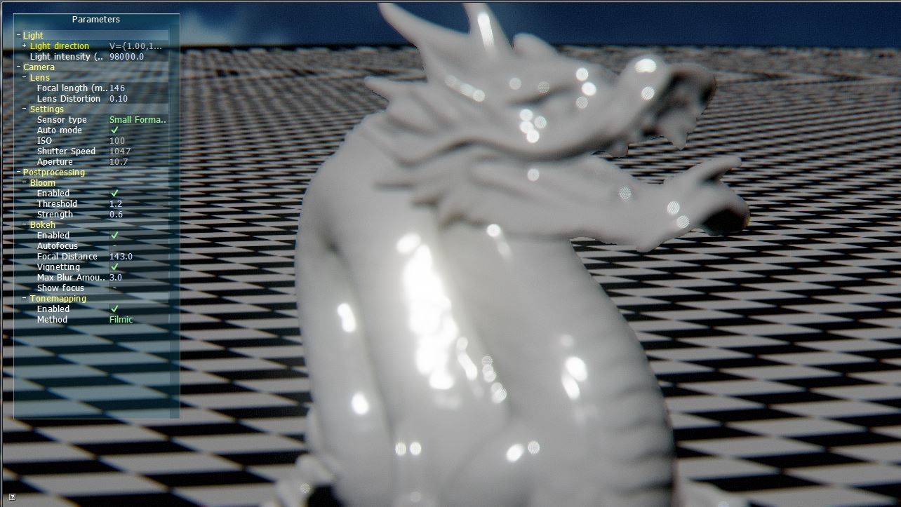
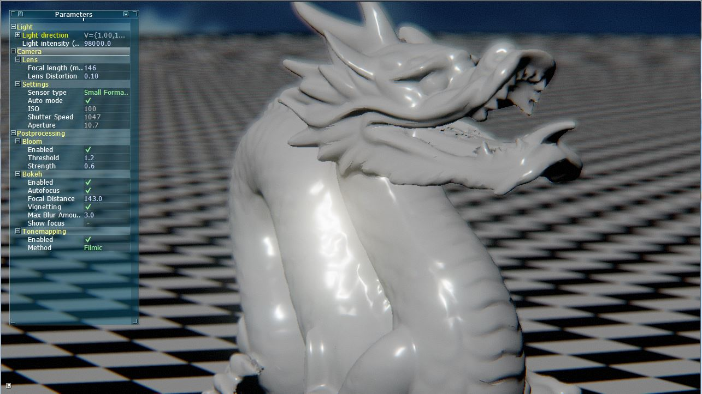

# PhysiCam #

[TOC]

## About ##

Physicam is an OpenGL library, which provides physically based camera rendering and parameters. It is based on OpenGL and designed to be used as either static library or dynamic library and can be integrated in existing applications.

*The following features are implemented:*
* Physically based sensor and focal length calculation
* Autoexposure
* Manual exposure
* Lense distortion
* Bloom *(influenced by ISO, Shutter Speed, Sensor type etc.)*
* Bokeh *(influenced by Aperture, Sensor type and focal length)*
* Tonemapping

This repository contains the PhysiCam source code and a test/example project using external libraries which are provided inside this repo.

## Build instruction ##

** Windows **
Just open the Visual Studio solution in `win\PhysiCam.sln` and build the PhysiCam project and (optional) the PhysiCamTest project.




** Linux **

*TODO*

## Getting started ##

This instructions will give you a quick example of how to use PhysiCam in your project.

#####initializing#####

First, we need to include the physicam header:
`#include <physicam.h>`

Now we need to initialize the PhysiCam internal system by calling the static function init, it will return true if everything went well:
```
if (!PhysiCam::Camera::Init())
{
	LOG_ERROR("failed to initialize PhysiCam");
}```

Then we create a physiCam object
```
PhysiCam::CameraPtr physicam = std::make_shared<PhysiCam::Camera>(m_FramebufferWidth, m_FramebufferHeight);
```
`m_FramebufferWidth` and `m_FramebufferHeight` are the integer sizes of your screen or framebuffer.

***

##### postprocessing #####

==PhysiCam needs two rendertextures: A RGB 32-float texture as color buffer (GL_COLOR_ATTACHMENT0) and a depth texture (GL_DEPTH_ATTACHMENT)==

To use the builtin postprocessing, we need to tell PhysiCam, which framebuffer objects to use for input and output. To do this, we use the `PhysiCamFBOInputDesc` struct.
Create a local or global variable and put the render texture ids into the struct:
```
PhysiCam::PhysiCamFBOInputDesc fboInpDesc;
[...]
fboInpDesc.FramebufferId = m_Framebuffer->GetId();
fboInpDesc.ColorTextureId = m_ColorTexture->GetTextureId();
fboInpDesc.depthBufferId = m_DepthTexture->GetTextureId();
```
This way we tell PhysiCam which render textures to use for postprocessing input.

Thats all for setting things up. Now we can use the camera.

##### Update/Usage #####

One of the main things we need is to setup the view matrix on every frame update. You can either use your own calculations and just provide the matrix to PhysiCam:
`physicam->GetTransform()->SetModelMatrix(mat);`

or use the builtin functionality of the transform class. By accessing the transform `physicam->GetTransform()` you can use all functions like `Translate`, `Rotate` etc. For more info look at transform.h

To set camera parameters, just call the accociated function, i.e. `physicam->SetFocalLength(80); //80mm`

To set postprocessing parameters (i.e. inside your update function), get the postprocessor by calling `auto pp = physicam->GetPostProcessor()`. Now you can set every camera postprocessing parameters, i.e: `pp->SetDoFFocalDistance(m_FocalDistance);`

==**Important:** Always call `physicam->Update(deltaTime);` in the end of your update function to update all camera internal matrices and parameters. ==


##### Rendering #####

For rendering with PhysiCam, just render your scene in the way you always/already do, just make sure verything gets rendered into the previous defined framebuffer/rendertextures and use the same matrices you hand over to physicam previously.
If you have used the builtin transform class, you can get view and model matrices by calling `physicam->GetViewMatrix()` and `physicam->GetProjectionMatrix()` or get a precalculated View-Projection matrix by calling `GetViewProjectionMatrix()`. Use them to render your objects.

To render the postprocessing, you just need to call `physicam->RenderPostProcessing(fboInpDesc, 0);`
As you can see, we here hand over the previously defined `PhysiCamFBOInputDesc` object, which contains the information about the framebuffer and render texture ids.
The last parameter is the framebuffer id of the output buffer. Here we provide 0, so the final image will be rendered to the default output, which is normally the window back buffer. This will show the final image on the screen.
Feel free to use your own postprocessing on the hand over framebuffer before calling `RenderPostProcessing`, to do it afterwards, just use your own framebuffer object id as last parameter and do your Postprocessing on it.

##### Complete example #####

```
// in main()
if (!PhysiCam::Camera::Init())
{
	LOG_ERROR("failed to initialize PhysiCam");
}

///

void init(int fbWidth, int fbHeight)
{
    // [...]

    PhysiCam::CameraPtr physicam = std::make_shared<PhysiCam::Camera>(fbWidth, fbHeight);

    // [...]
    // create framebuffer and render textures
    // [...]

    PhysiCam::PhysiCamFBOInputDesc fboInpDesc;

    fboInpDesc.FramebufferId = m_Framebuffer->GetId();
    fboInpDesc.ColorTextureId = m_ColorTexture->GetTextureId();
    fboInpDesc.depthBufferId = m_DepthTexture->GetTextureId();

	//optional: set startup camera parameters:
    physicam->SetFocalLength(55);
    physicam->UseAutoExposure(true);

    // [...]
}


void Update(float deltaTime)
{
	// [...]

    // [...] calculate camera matrix (camera position, rotation etc.)
    
    //set camera position and rotation
    physicam->GetTransform()->SetModelMatrix(mat);

	// (optional) change parameters:
    physicam->SetIso(200);

	// [...]

	//update PhysiCam matrices and values
	physicam->Update(deltaTime);
}

void Render()
{
	// [...] bind m_Framebuffer
    // [...] clear screen etc.

    // [...] render scene into m_Framebuffer

	//disable depth test since post processing doesnt need it
	glDisable(GL_DEPTH_TEST);
    
    //output framebuffer id 0 so it will be rendered to the window back buffer
	physicam->RenderPostProcessing(fboInpDesc, 0);
    
    // [...]
}
```

## Built With ##

* [glm](http://glm.g-truc.net/0.9.8/index.html)
* [glew-1.13.0](http://glew.sourceforge.net/)

*Test built with*

* *AntTweakBar*
* *assimp*
* *freetype*
* *freetype-gl*
* *GLFW*
* *rapidjson*
* *soil*
* [NoWork](https://github.com/0x2A/NoWork)

***

## Contributing ##

Feel free to fork this repository and create pull requests.

## Authors ##

* **Frank Köhnke** - *initial work* - [0x2A](https://github.com/0x2A)

*Contribute to see your name here :)*

## License ##

This project is licensed under the Apache 2.0 License - see [LICENSE.md](LICENSE.md) file for details.

## Acknowledgments ##

* Many thanks to anyone who's code was used
* Special thankts to Padraic Hennessy and [his blog](https://placeholderart.wordpress.com)
